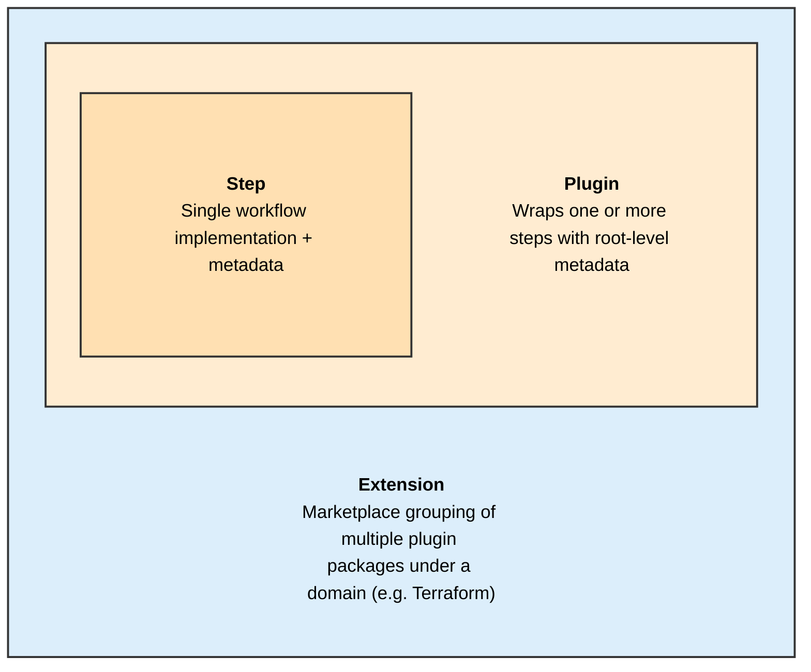
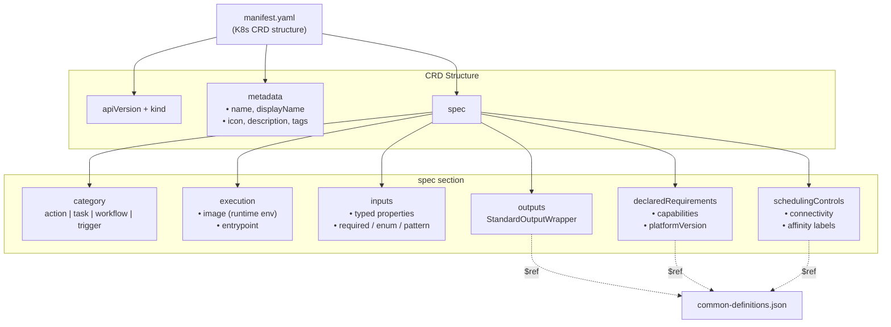
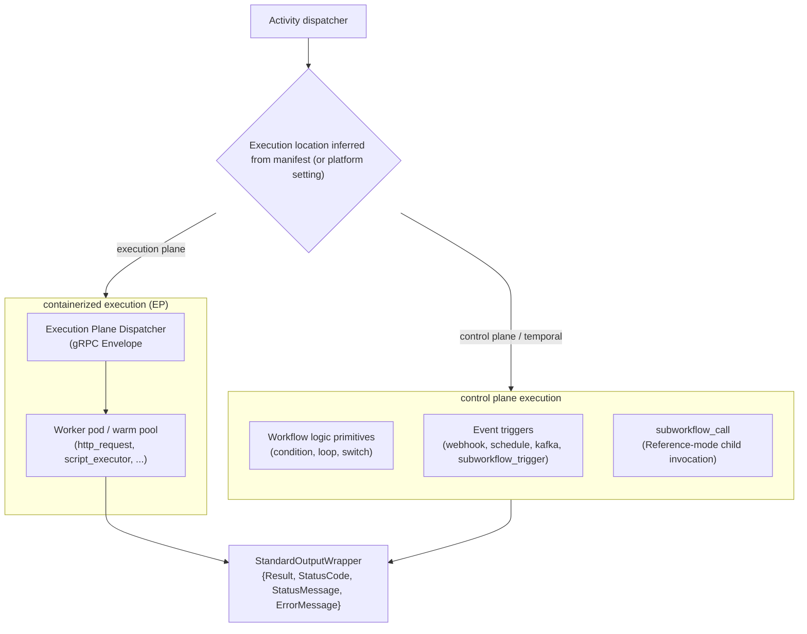
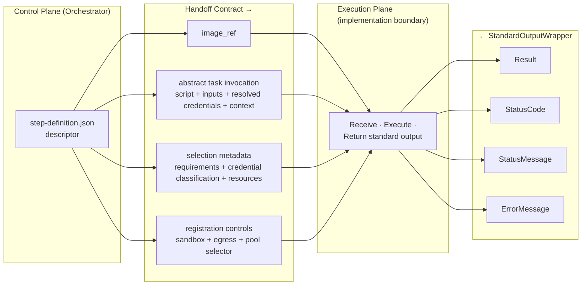
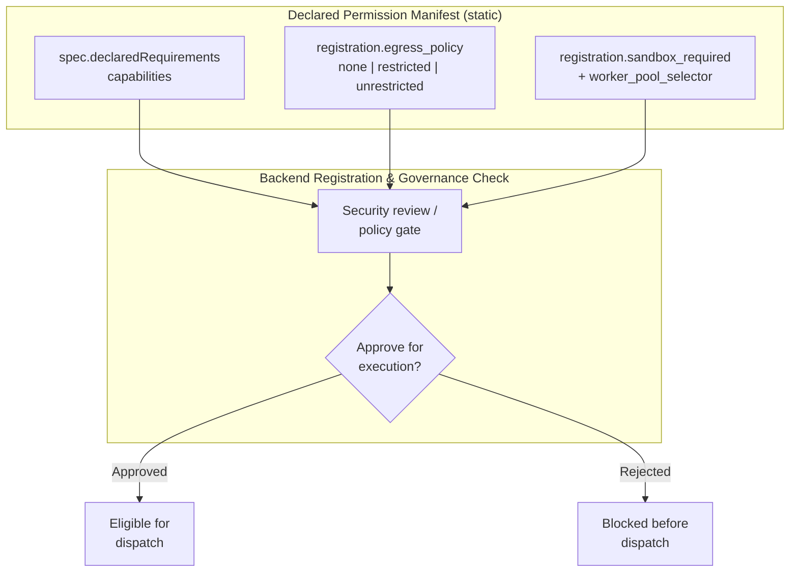

# Syntara Plugin SDK Architecture

The Syntara Plugin SDK is a schema-driven framework for authoring, validating, and registering
custom automation steps. This document defines the step taxonomy, the authoring format, the
registration contract, and the handoff the SDK makes to the platform.

> All JSON and YAML payloads in this document are illustrative. They do not define API
> endpoints, storage schemas, or ORM models.

## Step, Plugin, Extension Definitions



| Term | Definition | Ansible analogue |
|---|---|---|
| **Step** | A single workflow element with an input/output contract and metadata. "Step" covers all four categories, not only steps inside a workflow graph. | Module |
| **Plugin** | Wraps one or more step implementations, with root-level metadata pointing at each step's metadata. The versioned distribution unit. | Collection |
| **Extension** | A grouping of plugins under one domain, for marketplace organization. | — |

A plugin may contain steps of different categories — a trigger and a task together, for
example.

The plugin is the versioned ownership unit. This SDK contract defines its in-tree source layout
and discovery behavior; the packaged representation is outside this document's scope. A plugin
contains one or more explicitly listed step manifests. A step's canonical identity is
`<plugin-namespace>/<plugin-name>/<step-name>`; consequently, moving a step between plugins
changes its identity. Step names are unique only within a plugin, so different plugins may use
the same step name. The namespace comes exclusively from the parent `plugin.yaml`; a step manifest
declares only its local name.

## Ownership Boundaries

| Owner | Owns |
|---|---|
| **SDK** | `plugin.yaml` and step `manifest.yaml` source contracts, logical identity, schema validation, explicit discovery, declared requirements, the abstract task invocation, the `StandardOutputWrapper` result contract, step-side input validation |
| **Platform registration** | Administrative controls (`sandbox_required`, `egress_policy`, `worker_pool_selector`), metadata indexing, canvas projections |
| **Control plane (Temporal orchestrator)** | Placement decisions, dispatch, inline activity and listener registration, subworkflow lifecycle |
| **Execution plane** | Worker lifecycle and provisioning, transport adapter, runtime credential injection, sandbox enforcement, retries, persistence, log scrubbing, completion delivery |

Everything below describes SDK-owned contracts. Where a section names a platform or
execution-plane behavior, it is stating an assumption the SDK depends on, not specifying an
implementation.

Persistence and index normalization are platform-owned. The SDK returns validated plugin metadata
and step descriptors, but does not prescribe database tables or whether a platform embeds steps
in plugin records or stores separate step records.

## Principles

1. **YAML in, descriptors out.** Authors write `plugin.yaml` and step `manifest.yaml` files. The
   SDK validates them against JSON Schema Draft-07 and returns descriptors with identities derived
   from the plugin context. Packaging those descriptors is a separate concern.
2. **One category per step.** Every step declares exactly one of `action`, `task`, `workflow`,
   `trigger`.
3. **Functional contracts, not infrastructure.** Step definitions declare input/output schemas
   and abstract dependencies, similar to Ansible modules. They do not declare the infrastructure
   they run on.
4. **Declaration is not authorization.** `spec.declaredRequirements` states what a step needs.
   Administrators grant the corresponding controls at registration time in Syntara.
5. **Version the plugin as a unit.** The plugin version identifies a release of the plugin and all
   step contracts it contains. Steps have no independent version; changing any contained step
   requires a new plugin version. Version does not change the derived canonical step identity.
6. **Zero-trust credentials.** Authentication credentials are platform-managed references
   (UUIDs), never step inputs. Non-credential sensitive data may be an input flagged
   `redact: true`, which the platform must keep out of every observable path.
7. **Immutable output envelope.** `StandardOutputWrapper` (`Result`, `StatusCode`,
   `StatusMessage`, `ErrorMessage`) never changes shape, so template expressions such as
   `${task.Result}` survive plugin upgrades.
8. **Validate at three layers.** SDK tooling validates manifests during development and
   packaging; the workflow designer validates user inputs against step schemas during workflow
   authoring; base classes validate the invocation before step logic runs. The execution plane
   may additionally validate at its own boundary. No layer substitutes for another.

## Step Taxonomy

Defined canonically as `StepCategory` in `common-definitions.json`:

```json
"enum": ["action", "task", "workflow", "trigger"]
```

| Category | Purpose | Examples |
|---|---|---|
| `action` | Domain and external API integrations | `http_request`, `github_issue` |
| `task` | Atomic compute and script executors | `script_executor` (Python 3.12, Bash 5.2) |
| `workflow` | Control-plane logic and composition | `condition`, `loop`, `switch`, `subworkflow_call` |
| `trigger` | Event entry points | webhook, schedule, Kafka subscribe, manual, `subworkflow_trigger` |

All four categories are wrapped in a plugin and use the same registration and versioning path.

### Step Granularity

The SDK does not restrict how many operations a step performs internally. A step's
implementation is opaque to the platform: the SDK validates the declared input contract and the
returned result envelope, and cannot inspect or reject a step based on what happens between
those two boundaries. Fetching from SCM and then running a playbook inside one step is
permitted. From the platform's perspective a step is a single invocation returning one
`StandardOutputWrapper`, however many operations produced it.

Granularity is therefore an authoring-guidance concern, not an enforcement mechanism. Deciding
when to combine operations into one step versus splitting them across steps belongs in the
authoring guide.

### Subworkflow Composition

Reference-mode composition is split across two step contracts. The SDK owns their descriptors
and result shapes; the platform owns selection, eligibility enforcement, and child lifecycle.

| Step | Category | Role | Reference |
|---|---|---|---|
| `subworkflow_trigger` | `trigger` | Child-side entry point. Defines the child's required input schema and output contract. A workflow is eligible for Reference-mode invocation only if it contains an active one. | [tests/fixtures/steps/subworkflow_trigger/](../tests/fixtures/steps/subworkflow_trigger/) |
| `subworkflow_call` | `workflow` | Parent-side caller. Selects a child by `workflow_id`, surfaces the child's inputs as form fields, re-validates eligibility and execute permission at runtime, pauses the parent, and maps the child's terminal output into `StandardOutputWrapper.Result` (for example `${call_child.Result.summary}`). | [tests/fixtures/steps/subworkflow_call/](../tests/fixtures/steps/subworkflow_call/) |

## `manifest.yaml` — The Authoring Format

One `manifest.yaml` per step, following Kubernetes CRD conventions: `apiVersion`, `kind`,
`metadata`, `spec`. It supports comments and multi-line strings and validates against Draft-07 via
`$ref` into `common-definitions.json`.

**Plugin layout.** Plugins have a root-level source manifest so tooling can discover explicitly
declared steps without scanning the directory tree:

```
my-plugin/
├── plugin.yaml                # Root plugin manifest: identity, version, explicit step locations
├── steps/
│   ├── http_request/
│   │   ├── manifest.yaml      # Step manifest (K8s CRD structure)
│   │   └── main.py            # Implementation files
│   └── github_issue/
│       ├── manifest.yaml
│       └── main.py
├── README.md
└── tests/
```

This is a source-tree convention only. It does not define which files or resolved descriptors a
future packaged plugin contains.

`plugin.yaml` is a Draft-07 validated root contract. Its non-empty, unique `spec.targets` list
is authoritative: each target is a local relative YAML path resolved from `plugin.yaml`; no URL,
glob, recursive discovery, or implicit target is supported.

```yaml
apiVersion: syntara.io/v1alpha1
kind: Plugin
metadata:
  name: terraform_enterprise
  namespace: terraform
  displayName: Terraform Enterprise
  version: 0.1.0
  description: Workflow steps for Terraform Enterprise.
  authors:
    - name: Example Organization
      email: plugins@example.com
      url: https://example.com
  license: Apache-2.0
  documentationUrl: https://example.com/docs
spec:
  targets:
    - ./steps/create_workspace/manifest.yaml
    - ./steps/list_workspaces/manifest.yaml
```

**Example:**

```yaml
apiVersion: syntara.io/v1alpha1
kind: StepType

metadata:
  name: http_request
  displayName: HTTP Request
  icon: globe
  description: |
    HTTP/HTTPS API orchestrator with credential injection, response parsing,
    and retry logic.
  tags:
    - integration:rest-api
    - network:external
  authors:
    - name: Syntara Team
  license: Apache-2.0

spec:
  category: action
  execution:
    image: quay.io/syntara/http-request-executor:latest
    entrypoint: src.main:HttpRequestStep

  declaredRequirements:
    capabilities:
      - network-egress
      - readonly-root-filesystem
      - tmpfs-mount
    platformVersion: ">=3.0.0"

  schedulingControls:
    # Developer-declared hints only. Effective sandbox, egress, and worker-pool
    # policy comes from administrators at registration.
    connectivity_requirements:
      - host: api.github.com
        ports:
          - port: 443
            protocol: TCP

  inputs:
    properties:
      url:
        type: string
        description: Target HTTP/HTTPS URL
      customer_email:
        type: string
        description: Customer email used for the lookup; sensitive, not a credential
        redact: true
      method:
        type: string
        enum: [GET, POST, PUT, DELETE, PATCH]
        default: GET
    required:
      - url
      - method

  outputs:
    allOf:
      - $ref: "../common-definitions.json#/definitions/StandardOutputWrapper"

  resourceRequirements:
    limits: {cpu: 500m, memory: 256Mi}
    requests: {cpu: 100m, memory: 128Mi}

  executionTimeout: 60
```

### Diagram 1 — Manifest Composition



### Dynamic Resource Pickers

Some forms need to query an external endpoint at configuration time — an AAP inventory, an SCM
playbook list, an eligible child workflow. The static manifest schema stays authoritative for
field identity, type, requiredness, defaults, and validation. Picker results may supply values
or choices, but must not become a prerequisite for loading the descriptor or force the canvas to
reach a remote registry during editing.

> Provisional: the constraints above are requirements on any answer to SDP Q3, not the answer.

## Packaging and Registration

> **The packaging format is not decided** (Q6, out of scope here). The
> requirements below hold; the OCI specifics after them are provisional.

A plugin is built, versioned, published, and stored as a single artifact containing the compiled
manifests of every step it wraps. Every plugin uses the same structure with a
**root-level plugin manifest**, so the platform can locate and index step metadata from an
uploaded artifact without knowing the plugin's internal layout.

Whatever format is chosen must:

- carry a root-level plugin manifest that identifies the plugin and points at each step's metadata;
- keep step metadata coupled to the packaged implementation, so a descriptor cannot drift from
  the code it describes;
- allow the platform to read metadata and hydrate its index **without downloading the full
  artifact**, meeting the `<500 ms` canvas discovery and render target with no remote call while
  an editor is open;
- support semantic versioning per AC-5, with a defined update path; and
- avoid a proprietary registry dependency.

### OCI as the Leading Candidate (Provisional)

The current proposal is an OCI container image artifact carrying each manifest descriptor as a
referral layer annotation with media type `application/vnd.syntara.step.manifest.v1+yaml`.
Registration issues an OCI Distribution API manifest or digest query against `image_ref`, reads
the annotation, and hydrates the index in `<10 ms` without pulling layers. Re-registering a new
tag or digest is the descriptor-update path, which is what prevents metadata drift. This works
against vanilla OCI registries (Kubernetes, EKS, AKS, Quay).

Its appeal is precisely the drift property: the manifest travels inside the artifact rather than
being versioned separately alongside it. Any alternative format should be judged on whether it
preserves that.

### Diagram 2 — Authoring and Packaging Lifecycle

Format-specific steps are marked provisional pending Q6.

```mermaid
graph LR
    INIT["syntara-sdk init<br/>(scaffold plugin)"]
    AUTHOR["Author plugin manifest<br/>+ step manifest.yaml"]
    VALIDATE["syntara-sdk validate<br/>Draft-07 vs<br/>common-definitions.json"]
    BUILD["Build plugin artifact<br/>manifests + implementations"]
    REFERRAL["Attach metadata<br/>(referral layer -- provisional)"]
    PUBLISH["Publish/version artifact<br/>platform registration"]
    HANDOFF["Indexed in platform store<br/>available to orchestrator"]

    INIT --> AUTHOR
    AUTHOR --> VALIDATE
    VALIDATE -->|Pass| BUILD
    VALIDATE -.->|Fail: schema errors| AUTHOR
    BUILD --> REFERRAL --> PUBLISH
    PUBLISH --> HANDOFF
```



### Platform Metadata Assumptions

The SDK prescribes no database schema, ORM, persistence technology, or REST routing. It assumes
registration makes validated plugin descriptors available to platform consumers that can:

- retain a validated descriptor or equivalent canonical representation;
- expose canonical step identity, category, and parent plugin metadata;
- serve input and output schemas to the canvas and the execution plane;
- keep administrative registration policy separate from developer-authored manifests; and
- meet the `<500 ms` canvas target without remote artifact fetches during editing.

Whether a platform uses a relational database, document store, search index, cache, or embedded
records is intentionally unspecified. A platform-facing representation could contain values such
as:

```json
{
  "step_identity": "syntara/utility_steps/script_executor",
  "category": "task",
  "plugin": {
    "namespace": "syntara",
    "name": "utility_steps",
    "version": "1.0.0"
  },
  "sandbox_required": true,
  "egress_policy": "restricted",
  "worker_pool_selector": {"workload": "automation", "region": "us-east-1"}
}
```

Canonical identity and plugin metadata come from the root plugin descriptor; category comes from
the targeted step descriptor. `sandbox_required`, `egress_policy`, and `worker_pool_selector` are
administrator-supplied and are never read from developer metadata.

## Dispatch and Handoff

Manifests do not declare where a step runs. Placement is the **platform dispatcher's**
decision and is explicitly out of scope. The SDK's obligation is
narrower: the compiled manifest must carry enough detail for the dispatcher to decide. It
supplies:

- **Category** — the step's architectural role.
- **Resource requirements** — `resourceRequirements` and `executionTimeout`.
- **Declared requirements** — `declaredRequirements.capabilities`, which may make isolation
  mandatory.
- **Administrative policy** — `sandbox_required`, `egress_policy`, `worker_pool_selector` from
  registration.

> Whether these fields are *sufficient* under R13 is unverified until SDP Q10 is answered.



- **Control-plane placement** — the engine runs the step as a built-in activity or listener
  inside the orchestrator process. No execution-plane task or worker pod is created.
- **Execution-plane placement** — the engine resolves the descriptor and registration policy,
  builds the abstract task invocation (see [Credentials and Sensitive Data](#credentials-and-sensitive-data)), and
  hands it to the execution plane.

Both placements return the same `StandardOutputWrapper`, so downstream steps do not care where a
step ran. Placement may change between platform releases, or for the same step under different
administrative policy, without the manifest changing.

### Runtime Images

At execution the plane starts the runtime image, makes the plugin artifact's code available to
it, and then needs to know *which* step in that plugin to run. That is
`spec.execution.entrypoint` (`module.path:ClassName`).

**Every image-backed step declares a handle**, whether its plugin ships one step or twenty.
The schema requires `entrypoint` whenever `image` is set, so the runtime loads every step the
same way and there is no single-step special case to implement or get wrong. A plugin may
package several steps, and uniform loading is what makes that work without the runtime
needing to know how many there are.

The handle is a `module:Class` reference, not a shell command, because the step must be invoked
through its `BaseStep` subclass — that is where input validation and the `redact` echo check
live, and a subprocess would bypass both.


### Diagram 3 — SDK-to-Execution-Plane Handoff Contract



| Field | Carries |
|---|---|
| `image_ref` | The registered plugin artifact the descriptor was extracted from. Authoritative for the step's contract. |
| `execution.image` + `entrypoint` | The runtime image the step executes in, and the `module:Class` handle identifying which step the runner should load. |
| Abstract task invocation | Script, `inputs` (including `redact`-flagged values), credentials resolved from the workflow's credential bindings, and `workflow_context`. |
| Selection metadata | `declaredRequirements`, `resourceRequirements`, `executionTimeout` — enough for the platform to validate and route. |
| Registration controls | Administrator-owned `sandbox_required`, `egress_policy`, `worker_pool_selector`. |

### Control-Plane Handoff

Control-plane-placed steps use the same descriptor, schema metadata, and abstract invocation,
minus `image_ref` resolution and the transport hop. The control plane registers the activity or
listener and executes it inline. Two categories vary the return side:

| Step kind | Control plane performs | Returns |
|---|---|---|
| `workflow` primitives (`condition`, `loop`, `switch`) | Inline in-memory evaluation | `StandardOutputWrapper` |
| `subworkflow_call` | Eligibility and execute-permission re-validation, parent pause, inline child invocation, terminal-output collection | `StandardOutputWrapper` with child terminal outputs in `Result` |
| `trigger` (webhook, schedule, Kafka, `subworkflow_trigger`) | Listener binding from the descriptor, filter evaluation, workflow instantiation | Trigger activity log entry and initial workflow context |

> The trigger row conflicts with R4's "every step". See [Gaps](#gaps).

### Transport

The wire protocol between the control-plane dispatcher and the execution plane is undecided. The
SDK owns the invocation and result semantics and the compatibility constraints any protocol must
satisfy — message framing, neutrality to cold-start versus warm-pool lifecycle, and bidirectional
error and timeout signaling. The execution plane owns the adapter implementation, SIGTERM
handling, warm-pool provisioning, and completion signaling.

> Transport is undecided (SDP Q1); any `stdin` reference left in code is prototype residue.

## Credentials and Sensitive Data

**Authentication credentials** are never step inputs, and never identified in the manifest. A
step type is published before any credential exists and is installed into many Syntara
instances, so it cannot know a credential UUID. It declares **named requirements**: what kind of
credential it needs and how it wants the value presented.

```yaml
spec:
  credentialSpecification:
    credential_requirements:
      - name: api_auth
        description: Token for the target API
        types: [API Key, Bearer Token]
        required: true
        mount_type: tmpfs_file
        mount_path: /tmp/api-key
```

A credential UUID enters the picture later, and never in anything the SDK owns:

| Moment | What happens | Where the UUID lives |
|---|---|---|
| **Authoring** (step) | Author declares `credential_requirements` | nowhere — no credential exists yet |
| **Authoring** (workflow) | Workflow author picks a credential on the canvas and **binds** it to a requirement | the workflow definition |
| **Deployment** | Platform validates the credential exists and the workflow owner may use it | unchanged |
| **Dispatch** | Platform authorizes against the invoking actor, resolves the UUID to a value, hands it to the execution plane | resolved and discarded |

Binding at workflow-authoring time is what lets two steps of the same type use different
credentials — two `http_request` steps hitting two APIs — which a step-type-level or
registration-level binding could not express.

**Non-credential sensitive data** — PII, business-sensitive fields — *is* a normal input,
flagged `redact: true`. The step receives the value because it needs it; the flag governs where
that value is allowed to appear afterwards.

| | Authentication credentials | Sensitive non-credential data |
|---|---|---|
| Declared as | a named `credential_requirements` entry | an input with `redact: true` |
| Reaches the step | resolved out of band by the execution plane | in the `inputs` map |
| In the step descriptor | the requirement only — never a UUID or value | schema flag only, never a value |

### The Non-Disclosure Guarantee

Neither a credential value nor a `redact`-flagged input value may appear in:

- `StandardOutputWrapper` fields (`Result`, `StatusMessage`, `ErrorMessage`)
- workflow variables and template expression results
- error messages and stack traces
- execution logs
- persisted state

The platform dispatcher and execution plane enforce this across every observable path —
invocation, output, error, and logging — and are the **authoritative security boundary**. The
SDK does not define the scrubbing implementation.

### SDK-Side Echo Check

As defense in depth, SDK base classes validate that a step implementation does not echo a
`redact`-flagged input value into its output. This catches the common authoring mistake of
returning a sensitive input in a result payload. It is a secondary check: it runs inside the
step process, sees only that step's own inputs and outputs, and does not relieve the platform
of the guarantee above.

**Authorization is the platform's.** Nothing in the SDK constrains *which* credentials a step
may request. A step declares the references it intends to use; the platform decides whether the
request is permitted at dispatch time, based on the invoking actor's permissions and the
credential's own access policy.

## Policy and Registration Controls

Three parties, three responsibilities:

1. **The step declares.** `manifest.yaml` supplies category, execution metadata, input/output
   schemas, `redact` markers, `resourceRequirements`, `credentialSpecification`, and
   `declaredRequirements`. `capabilities: [network-egress]` says the step needs outbound
   connectivity; it does not grant it.
2. **Administrators decide.** `sandbox_required`, `egress_policy`, and `worker_pool_selector`
   arrive through the registration API. They are authoritative for the registered step and are
   independent of image metadata. Pools may be provisioned automatically or assigned by
   operations.
3. **The execution plane enforces.** It receives the descriptor, the invocation, the declared
   requirements, and the administrative controls, and owns everything runtime: worker lifecycle,
   provisioning, credential injection, sandbox and transport enforcement, retries, persistence,
   log scrubbing, and completion delivery.

### Diagram 4 — Registration Governance Inspection

This is a static policy and metadata flow evaluated by the backend during registration and
dispatch preparation. It is not code running inside the SDK.



Every inspection point resolves without executing the step.

## Schema Reference

`common-definitions.json` is the sole platform meta-schema and the authoritative source for
shared types. Individual steps do not ship their own `.schema.json` files: authors write
`manifest.yaml`, the SDK produces validated descriptors, and platform consumers use those
descriptors rather than the source manifest.

| Definition | Purpose | Shape |
|---|---|---|
| `PluginManifest` | Root plugin validation | `{apiVersion, kind, metadata, spec.targets}`; plugin metadata requires name, namespace, displayName, version, description, and non-empty authors |
| `StepTypeManifest` | K8s CRD structure validation | `{apiVersion, kind, metadata, spec}`; step metadata requires `name`, `displayName`, and `description`; namespace and release version come exclusively from the parent plugin |
| `Author` / `Authors` | Attribution | author name is required; email and URL are optional; plugin authors are required while step authors are optional |
| `StepCategory` | Four-category taxonomy | `enum: ["action", "task", "workflow", "trigger"]` |
| `StepInputs` | Draft-07 input object | `{properties, required}` |
| `InputParameter` | One input, including sensitivity | `redact: true` |
| `StandardOutputWrapper` | Immutable output contract | `{Result, StatusCode, StatusMessage, ErrorMessage}` |
| `CredentialSpecification` | Step credential requirements | `{credential_requirements}` |
| `CredentialRequirement` / `CredentialRequirementList` | Named credential requirement; no UUID | `{name, types, required, mount_type, mount_path, header_name}` |
| `DependencyDeclaration` | Language-specific dependency declaration | per-runtime package list |
| `ResourceRequirements` | Kubernetes resource shape | `{limits: {cpu, memory}, requests: {cpu, memory}}` |
| `ExecutionTimeout` | Total step timeout in seconds | integer |
| `SchedulingControls` | Developer-declared placement hints | `{connectivity_requirements, affinity_labels}` |
| `StepPaletteIcon` | Canvas palette glyph | enum |
| `StepRegistrationPolicy` | Administrator-owned controls | `{sandbox_required, egress_policy, worker_pool_selector}` |

`spec.retryPolicy` (`max_attempts`, `initial_interval_seconds`, `backoff_coefficient`,
`retryable_status_codes`) also exists in the schema but has no corresponding SDP requirement. It
is the natural hook for the Temporal durable-execution question (SDP Q8).

### Compiled Descriptor Shape

```json
{
  "apiVersion": "syntara.io/v1alpha1",
  "kind": "StepType",
  "metadata": {
    "name": "http_request",
    "displayName": "HTTP Request",
    "icon": "globe",
    "description": "...",
    "tags": ["integration:rest-api", "network:external"]
  },
  "spec": {
    "category": "action",
    "execution": {
      "image": "quay.io/syntara/http-request-executor:latest"
    },
    "inputs": {"...": "typed properties"},
    "outputs": {"$ref": "common-definitions.json#/definitions/StandardOutputWrapper"}
  }
}
```

## Reference SDK (Phase 1, Python)

Python is the reference implementation, not the contract. Another language binding must preserve
manifest compatibility, pre-execution input validation, credential-reference semantics, and the
standard output envelope — but not these class names.

`BaseStep[TInput, TOutput]` is the base execution contract, specialized as `ActionStep`,
`TaskStep`, `WorkflowStep`, and `TriggerStep`. Typed inputs and outputs are Pydantic models.
`ExecutionContext` carries workflow context to step logic without coupling it to a worker or
transport, and `CredentialRequirement` / `CredentialBinding` / `BaseCredential` model the credential
contract.

## Reference Implementations

| Example | Category | Runtime image | Location |
|---|---|---|---|
| `http_request` | action | dedicated image | [tests/fixtures/steps/http_request/](../tests/fixtures/steps/http_request/) |
| `script_executor` | task | generic runner + `entrypoint` | [tests/fixtures/steps/script_executor/](../tests/fixtures/steps/script_executor/) |
| `subworkflow_call` | workflow | null (platform-owned) | [tests/fixtures/steps/subworkflow_call/](../tests/fixtures/steps/subworkflow_call/) |
| `subworkflow_trigger` | trigger | null (platform-owned) | [tests/fixtures/steps/subworkflow_trigger/](../tests/fixtures/steps/subworkflow_trigger/) |

Each carries a complete `manifest.yaml`, the descriptor fields used for registration and canvas
metadata, and a README describing its contract and execution boundary. Where an example has
executable code, its test suite demonstrates validation and registration. Platform-owned steps
may ship a descriptor and contract reference with no local runner.

## Gaps

SDK-side gaps that nothing yet covers. Open questions live in the SDK SDP and
are not mirrored here.

- **Workflow step-reference resolution.** The canonical identity is derived as
  `namespace/plugin/step`, but workflows should not reconstruct it from fields copied into the
  step manifest. The workflow contract must decide whether it stores an opaque installed-step ID
  or a structured plugin reference plus local step name. It must also decide whether plugin
  version, immutable artifact identity, or both are pinned.
- **Control-plane code loading and isolation.** Nothing defines how a control-plane-placed
  step's code enters the orchestrator process, what sandboxing applies, or whether it is
  restricted to first-party or pre-vetted code. Arbitrary author-supplied code in the control
  plane is an open security question, sharper now that authors cannot influence placement.

  *Candidate answer — dual-mode consumption.* Package every plugin the same way, and let the
  artifact be consumed two ways off one contract. In execution-plane mode the container's `CMD`
  launches the SDK runner, which imports `spec.execution.entrypoint` and calls the step through
  its `BaseStep` subclass. In control-plane mode the orchestrator extracts the source from a
  well-known path in the artifact and imports the same handle directly. Same code, same
  entrypoint, same validation path; only the caller differs.

  Two things recommend it. It matches the SDP, which already says every category — `workflow`
  and `trigger` included — is wrapped in a plugin and published as an artifact. And it removes a
  placement tell we reintroduced by accident: `execution.type` was deleted so manifests could
  not declare placement, but `image: null` now correlates 1:1 with control-plane execution
  across all four reference steps. Under dual-mode every step has an artifact and a handle, the
  runtime image is optional, and placement stays the dispatcher's call (Q10).

  It would also make `entrypoint` required unconditionally rather than only when `image` is set,
  since the handle becomes the uniform element and the image the variable one.

  It does not resolve the security question above — it presupposes an answer. Adopt only once
  arbitrary author code in the control plane is settled.
- **Multiple runtime images per step type.** `spec.execution.image` is a single string with no
  override mechanism, so a step cannot offer per-platform variants and an administrator cannot
  substitute a hardened base runner. Whether the runtime image belongs in the manifest at all,
  or is bound at registration or workflow build time, is undecided.
- **Trigger prototype does not fit R4.** R4 requires *every* step to expose `StandardOutputWrapper`, but a
  trigger instantiates a workflow rather than returning a result to a downstream step, so the
  requirement does not hold for one of the four categories. Needs either a carve-out in R4 or a
  change to the trigger contract.
- **Authoring guidance (AC-8 / R11).** Step creation, testing, validation, and composition
  guidance is required by the SDP and does not exist yet.
